# S2 Covering Examples

Here are some examples of the "cell coverage" feature of the new
spherical geometry package. We pick some point on the sphere, and create
a circular cap of some size around that point. We then cover the cap
with some number of "cells". The result is then projected onto a plane
tangent to the center of the cap and parallel to the surface of the
sphere. The cells are drawn in blue and the cap itself is drawn in red.

This point happens to be centered on the Google offices in Kirkland,
with a 5 km radius cap. When you try to cover that cap with just one
cell, you often end up with a large amount of extra space. Notice the
large cell compared to the circle.

Same configuration, except we allow the use of 2 cells.

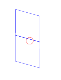

Same configuration, except we allow the use of 3 cells. One of them is
quite small.

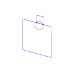

Same configuration, except we allow the use of 4 cells. I've changed the
scale factor so we can see more detail.

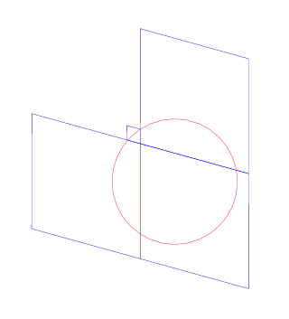

Same configuration, except we allow the use of 5 cells.

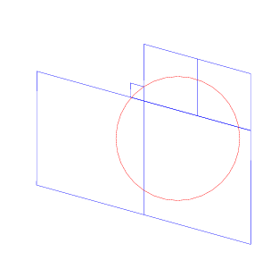

Same configuration, except we allow the use of 6 cells.

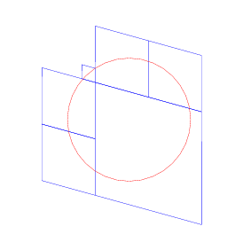

Same configuration, except we allow the use of 10 cells.

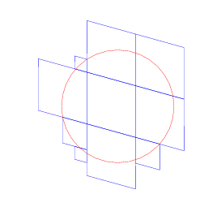

Same configuration, except we allow the use of 20 cells.

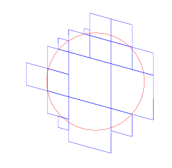

Same configuration, except we allow the use of 50 cells.

Same configuration, except we allow the use of 500 cells. The scale has
been changed again to show more detail.

This is a point at an edge between two faces of the cubic tiling, with a
cap size of about 500 km and limit of 4 cells. The ratio of "area
covered by the cells" to "area covered by the cap" is about 10, which is
about the worst case value when you have at least 4 cells. (The ratio
can be quite large, on the order of 10\^15, if you limit the covering to
fewer than 4 cells.)

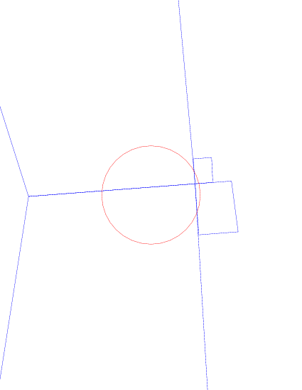

Same configuration, except we allow the use of 6 cells.

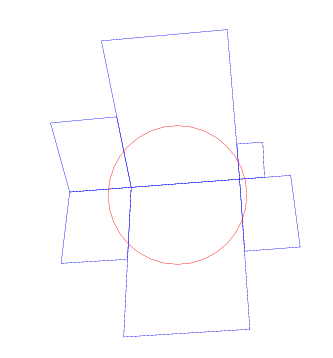

Same configuration, except we allow the use of 50 cells.

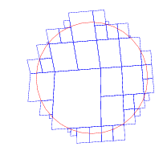

Same configuration, except we allow the use of 500 cells.

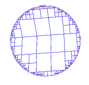

This is a point at the corner where three faces meet. The cap radius is
10 km, and we're using 10 cells.

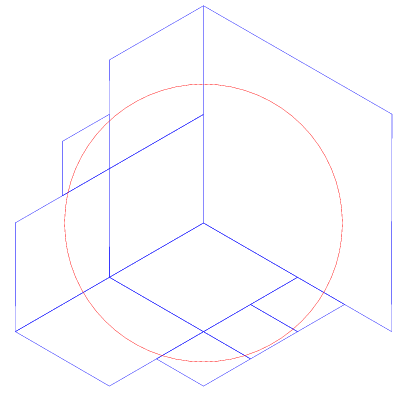

Same configuration, except we allow the use of 20 cells.

Same configuration, except we allow the use of 50 cells.

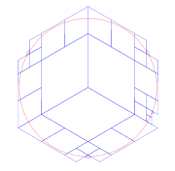

Same configuration, except we allow the use of 200 cells.

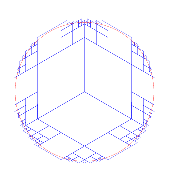

Same configuration, except we allow the use of 1000 cells. Note that in
fact the code did not use all 1000 cells: this covering only uses 706
cells. There was a point where the code had 1000 candidate cells, but
after pruning the code merged some adjacent sets of cells into a smaller
number of larger cells. The details of the covering did not change, it
is merely a more efficient representation.

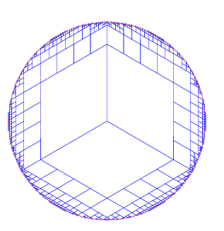

This shows a latitude/longtitude rectangle (instead of a circular cap)
which is roughly placed over Washington state. (The coordinate system
that we're using for the project is not oriented to put North up, which
is why it looks a bit weird.) Here is a covering with 10 cells..

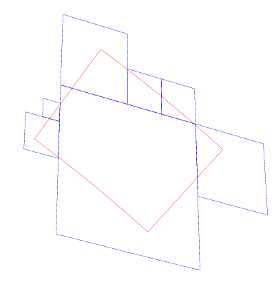

Same configuration, except we allow the use of 20 cells.

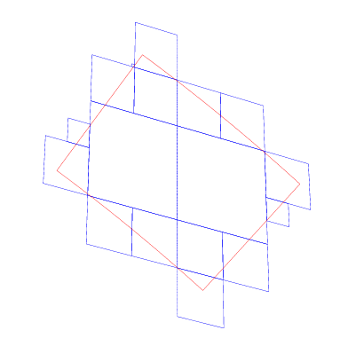

Same configuration, except we allow the use of 100 cells.

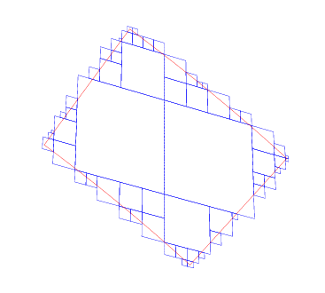

This shows a latitude/longtitude rectangle extends from 60 degrees north
to 80 degrees north, and from -170 degrees to +170 degrees longitude.
The covering is limited to 8 cells. Notice that the hole in the middle
is completely covered.

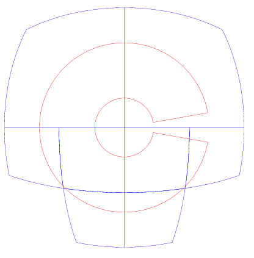

Same configuration, except we allow the use of 20 cells.

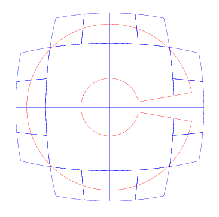

Same configuration, except we allow the use of 100 cells. Now we have
sufficient numbers of cells to model the hole, but not the gap near the
date line.

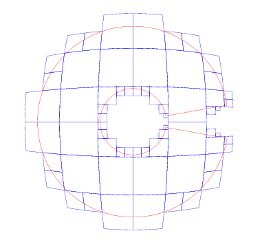

Same configuration, except we allow the use of 500 cells.

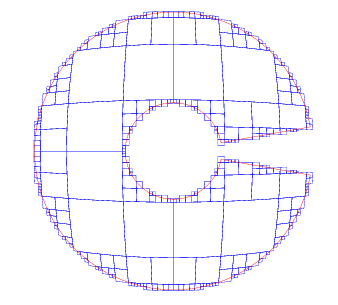

Finally, here are some examples of geographic coverings.  This is a covering of
Hawaii using 25 cells.

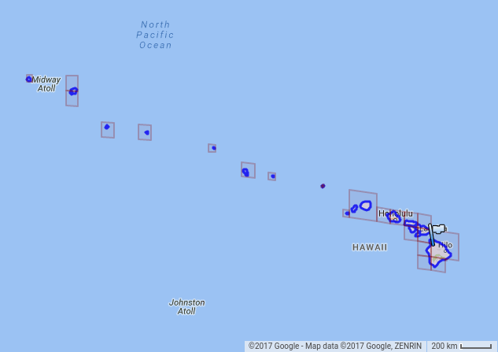

Here is a covering of Florida using 22 cells.

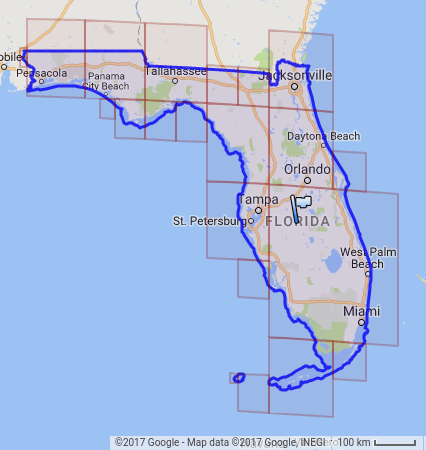

And Florida using 152 cells.

